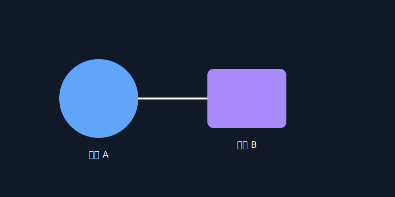

# 主标题（H1）

这是一个用于验证的完整文章。它演示标题、日期、标签、封面、图片、代码块、链接和表格等通用元素的展示。

## 二级标题（H2）

支持段落与行内代码 `const x = 1`，以及有序与无序列表：

1. 有序列表项 A
2. 有序列表项 B

- 无序列表项 X
- 无序列表项 Y

### 三级标题（H3）

代码块示例：

```js
export function add(a, b) {
  return a + b
}
```

```ts
type User = { id: string; name: string }
const u: User = { id: '1', name: 'Alice' }
```

```html
<div class="card">
  <h4>Demo</h4>
  <p>HTML 代码块示例</p>
</div>
```

```css
.card { padding: 12px; border-radius: 8px; }
```

## 图片与资源

本地相对图片（自动重写为 /posts/demo-verify/... 路径）：



外链图片：


相对链接到资源文件：

[查看备注](./assets/notes.txt)

外部链接：

[Vue 官方网站](https://vuejs.org/)

## 表格

| 字段 | 说明 |
|------|------|
| title | 标题，渲染为 h1 |
| date | 日期，显示在信息栏 |
| tags | 标签数组，显示为标签 |
| cover | 封面图片路径 |
| reading_time | 阅读时间（分钟） |

## 结语

该文档覆盖常见元素，便于验证页面的解析与布局是否符合预期。

